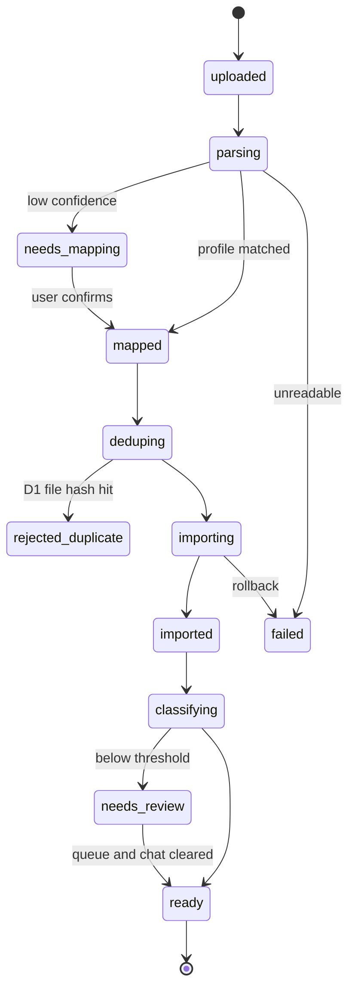

# Vekst — End-to-End Workflow v4

Date: 2026-08-20 · Team: 2 developers
Product shape: the **Palm v0.3 spec**, adopted. Technical shape: `docs/ARCHITECTURE.md`.
Companion documents: `IMPLEMENTATION_PLAN.md`, `BACKLOG.md`, `SPEC-RECONCILIATION.md`.

Printable diagram: `docs/workflow-overview.png` and `docs/workflow-overview.pdf`.
Source: `docs/workflow-overview.mermaid`.

> **This document describes the finished product.** It is not the MVP.
> The MVP is the **Management P&L and nothing else**. Which parts of this flow exist at
> each milestone is in section 0 below and in `IMPLEMENTATION_PLAN.md` section 0.

---

## 0. What exists when

| Part of the flow | Demo 10-01 | Product 11-20 | Commercial 01-15 |
| --- | --- | --- | --- |
| Landing page | — | simple | full site |
| Two developers, two tracks | A: ingest · B: meaning | same | same |
| Wizard + RP score + proposed package | — | — | ✔ |
| Payment wall, Paddle | — | invoice by hand | ✔ |
| Upload screen | ✔ | ✔ | ✔ |
| Parse: charset, delimiter, locale | ✔ | ✔ | ✔ |
| **Validation: correctness + balance check** | **✔** | ✔ | ✔ |
| Override a completeness warning | — | ✔ | ✔ |
| Column-mapping screen | you write profiles in SQL | ✔ | ✔ |
| Dedup D1–D3 + internal transfers | ✔ | ✔ | ✔ |
| D4 ledger↔bank matching | — one source kind per customer | ✔ | ✔ |
| Engine L0, L0.5, L1, L2 (Go) | ✔ | ✔ | ✔ |
| Engine L3 fuzzy (`pg_trgm`) | — | ✔ | ✔ |
| Engine L4 (Python, embeddings + LLM) | — | — | — (Intelligence) |
| Review queue | ✔ | ✔ | ✔ |
| Chat + escalation + consultant queue | — | — | ✔ |
| Readiness check | — one report only | ✔ | ✔ |
| **Management P&L + drill-down** | **✔** | **✔** | **✔** |
| Sales / OPEX / Cash Flow | — | — | ✔ |
| Deviation highlighting | — | — | ✔ |
| XLSX export | — | ✔ | ✔ |
| PDF export | — | — | ✔ |
| Roles and permissions | — you create both users | ✔ | ✔ |
| Dark mode | — | ✔ | ✔ |
| Languages | en + ru | en + ru | + de |
| Dunning and erasure | — | — | ✔ |

---

## 1. What changed from v1, and what I conceded

| v1 said | v2 says | Why |
| --- | --- | --- |
| No payment before the first report | Payment at screen 4, before upload | Palm's model carries a real per-customer consultant cost. You cannot give away human hours |
| A "confirmed proposal" screen after parsing | A **per-report readiness check** | Palm already solved this better: each report opens when the loaded data covers its lines, and names what is missing |
| Review queue only | **Review queue and chat** | Both are needed. See 3.7 |
| One report (P&L) | RP package of 4 reports in Commercial, Management P&L in Demo | Palm |
| One business per account | Organisation → entity → account | Palm's wizard scores up to 12+ legal entities |
| Ingest is bank files | Ingest is **ledger or bank**, tracked per batch | Mixing them without matching double-counts |

I was wrong about the "confirmed proposal" screen. Palm's readiness check is the same idea
executed better, and it lives where the user already is instead of adding a screen.

---

## 2. The workflow at a glance

```mermaid
flowchart LR

  subgraph S1["① DECIDE — free, under 3 minutes"]
    direction TB
    A["Screen 1 — Landing<br/><small>one question, one call to action</small>"] --> B["Screen 2 — Wizard<br/><small>5 scoring questions<br/>+ 4 the maths needs</small>"]
    B --> C["Screen 3 — Proposed package<br/><small>RP1…RP5 from a weighted score<br/><b>the value moment, still free</b></small>"]
  end

  subgraph S2["② COMMIT"]
    direction TB
    D["Screen 4 — Self-serve or consultant<br/><small>consultant = +$30 per report</small>"] --> E["Pay — Paddle<br/><small>Merchant of Record, handles VAT</small>"]
  end

  subgraph S3["③ INGEST — load → parse → validate → persist"]
    direction TB
    F["① Screen 5 — Load documents<br/><small>CSV / XLSX now, API later<br/><b>every batch tagged ledger or bank</b></small>"] --> G["② Parse<br/><small>charset · delimiter · header row<br/>number and date locale</small>"]
    G --> H{"Mapping<br/>confident?"}
    H -- yes --> I["Auto-map<br/><small>20-row preview</small>"]
    H -- no --> J["Confirm columns<br/><small>saved as an import profile</small>"]
    I --> V["③ Validate<br/><small>correctness per row<br/><b>opening + movements = closing</b></small>"]
    J --> V
    V --> W{"Valid?"}
    W -- "errors" --> X["Reject the batch<br/><small>nothing is persisted<br/>error list by original line no.</small>"]
    W -- "ok / warnings" --> K["④ Persist + dedup<br/><small>one row per payment or posting<br/>D1 file · D2 in-batch · D3 cross-batch<br/>D4 ledger↔bank · internal transfers</small>"]
    X -. "fix and re-upload" .-> F
  end

  subgraph S4["④ CLASSIFY"]
    direction TB
    L["⑤ Classification engine<br/><small>L0 vendor · L0.5 account code · L1 org rules<br/>L2 seed · L3 fuzzy · L4 model</small>"] --> M{"Confidence<br/>≥ 0.80?"}
    M -- yes --> P["Classified"]
    M -- no --> N["Screen 6a — Review queue<br/><small>volume: by amount, by vendor</small>"]
    N --> O["Screen 6b — Chat<br/><small>the ambiguous residue</small>"]
    O -- "3 questions,<br/>under 80% filled" --> Q["Offer a consultant<br/><small>Wizard-of-Oz request queue</small>"]
    N --> P
    O --> P
    Q --> P
    P -. "approval writes vendor memory" .-> L
  end

  subgraph S5["⑤ SEE IT"]
    direction TB
    R["Readiness check<br/><small>ready · partial · blocked<br/>each report names its gaps</small>"] --> S["Screen 7 — Dashboard<br/><small>tables · Sankey · deviation highlighting<br/>drill-down to the transaction</small>"]
    S --> T["Export XLSX / PDF"]
  end

  subgraph S6["⑥ EVERY MONTH — where retention lives"]
    direction TB
    U["Next period → repeat from ③<br/><small>import profile matches, no mapping screen<br/>vendors repeat, so L0 catches them<br/><b>target: under 3 minutes of user effort</b></small>"]
  end

  C ==> D
  E ==> F
  K ==> L
  P ==> R
  T ==> U

  classDef free  fill:#eaf0f8,stroke:#4a6fa5,stroke-width:1.5px,color:#1c2b3a
  classDef pay   fill:#f6ece9,stroke:#a05a4a,stroke-width:1.5px,color:#3a1f1c
  classDef work  fill:#e7f2ec,stroke:#3f7d62,stroke-width:1.5px,color:#14301f
  classDef gate  fill:#f8f0e4,stroke:#a5804a,stroke-width:1.5px,color:#3a2d1c
  classDef stop  fill:#f7e6e6,stroke:#a04a4a,stroke-width:1.5px,color:#3a1c1c
  classDef out   fill:#f2ecf6,stroke:#7a5a95,stroke-width:1.5px,color:#2c1c3a
  classDef phase fill:#fbfbfc,stroke:#c9c9d1,stroke-width:1px,color:#3f3f46
  class A,B,C free
  class D,E,Q pay
  class F,G,I,J,V,K,L,N,O,P,U work
  class H,M,W gate
  class X stop
  class R,S,T out
  class S1,S2,S3,S4,S5,S6 phase
```

Phase ⑥ returns to phase ③, every month. That loop is the product. Phases ① and ② happen
once.

---

## 3. Stage detail

### Screen 1 — Landing

- One screen, one question, one call to action.
- The promise to test: *"Upload your data. Get the management reports your business
  actually needs."*
- No demo request, no sales form.

### Screen 2 — Wizard

Nine questions, one per screen, under 3 minutes. Five score the customer; four make the
arithmetic correct. Section 4 lists them.

**Rule:** if the answer can be read from the uploaded file, do not ask it. Infer it, then
confirm it on the mapping preview. Every question you delete raises conversion.

### Screen 3 — Proposed package

- The weighted score produces RP1…RP5. The screen shows the report set for that package.
- Still free. This is the value moment, and it is the only thing the customer has before
  they pay.
- Templates that do not exist yet are shown as "in development", and the customer's picks
  are recorded. That list is your roadmap ranked by real demand.
- **[F-2]** No dates next to "in development". Never promise a date to a stranger.

### Screen 4 — Self-serve or consultant, then pay

- Self-serve is included in the subscription. The consultant is +$30 per report, a single
  charge, 3 hours × $10, no hourly tracking.
- Payment happens here, through Paddle. Paddle is Merchant of Record, so it also handles
  EU VAT and sales tax registration.
- **Risk to watch:** the customer pays on a promise, with none of their own data on screen.
  Measure the drop-off between screens 3 and 4 from day one. If it is severe, the fix is
  to open the self-serve path before payment and keep the wall only in front of the
  consultant, where the real cost is.

### Screen 5 — Unified ingest

- One step: bring your data. Files now (CSV, XLSX); OAuth connectors in Intelligence.
- **Every batch is tagged `ledger` or `bank`.** This tag decides the accounting basis of
  every line computed from it, and it drives D4 matching. It is not optional.
- Show a good example file per source: bank export, 1C export, card statement. Ship one
  downloadable sample of each.
- Parse: charset (UTF-8, BOM, Windows-1251, CP866), delimiter, header row, number locale,
  date format.
- Map: 20-row preview, one dropdown per field, auto-suggested from English and Russian
  headers, saved as an import profile and reused silently next month.

### Validate — runs after mapping, before anything is saved

This stage is blocking. A file that fails persists **nothing**: the import is atomic.

**Correctness, per row.** Date parses and is plausible · amount parses to minor units ·
currency is a valid ISO code · debit and credit are not both populated · no U+FFFD
replacement characters (which means the charset guess was wrong) · description present ·
account resolves. A correctness error rejects the batch and cannot be overridden.

**Completeness, per file.** The important one is **opening balance + Σ movements =
closing balance**, with zero tolerance. Most bank statements declare both balances. If
that equation holds, no row was lost, truncated or mis-signed — and it is the only proof
of completeness you will ever have. Also: the declared row count matches, the statement
period is covered continuously, one currency per account, no duplicate bank references.

A completeness failure may be overridden by an `approver`, with a written reason, which is
recorded and shown on every report computed from that batch.

What the user sees on failure:

> **Validation failed.** 3,182 rows read · 3,179 valid · **3 errors**
> Balance check: opening 412,300.00 + movements −18,442.15 ≠ closing 393,860.00
> (difference 2.15). Nothing was imported. [Download the error list]

The error list is keyed by **line number in the original file**, never by parsed row
index. Somebody has to find that row in Excel.

### Persist — one row per payment or posting

A bank payment becomes one row. A ledger document with five postings becomes five rows
sharing one `document_ref`. This keeps ledger detail and is what makes D4 matching
possible.

### Dedup and matching — runs during persist

| Level | Detects | Action |
| --- | --- | --- |
| D1 | The same file uploaded twice | Reject: "already imported" |
| D2 | Repeated rows inside one file | Skip and count |
| D3 | Rows already present from another file | Skip and count |
| D4 | An invoice in the ledger and its payment in the bank | **Propose a link. Never delete.** A human confirms |
| — | Internal transfers between the customer's own accounts | Propose, then exclude from every P&L line |

The user sees one line:

> 412 rows imported · 88 duplicates skipped · 6 internal transfers found ·
> 12 possible matches to your accounting data — review

D4 is what stops the "single financial model" from counting revenue twice.

### Screen 6a — Review queue (volume)

- Everything below the confidence threshold, sorted by **amount first, then repeat count**,
  grouped by counterparty. The customer fixes the €40,000 line before the €4 line.
- Keyboard-first: number keys pick a category, Enter approves, `T` marks an internal
  transfer, `N` marks non-P&L.
- One decision covers every row from that counterparty, and writes vendor memory. The same
  counterparty never appears again.
- Only `owner`, `admin` and `approver` may resolve. `viewer` sees it read-only.
- Target: 12 months of first-time data resolved in under 15 minutes.

### Screen 6b — Chat (the residue)

- Palm's messenger interface, for what the queue cannot settle: rows where the question is
  not "which category" but "what is this".
- Example: *"We cannot place account «Прочие 4410». Which report line does it belong to?"*
- **Escalation rule, adopted from Palm as specified:** count the clarifying questions and
  the template fill rate. After 3 questions, if the template is under 80 percent complete,
  the system offers a consultant. It does not wait for the user to give up.
- The consultant request goes to an admin queue and a Telegram or email relay. A human —
  you — answers it. Do not automate this yet.

Why both 6a and 6b: chat works when the source is 1C, because L0.5 account-code rules
resolve most lines and only a handful remain. It fails for a bank statement, where a new
customer can have 80 unknown counterparties. Eighty chat messages is not a product.

### Readiness check

Each report inspects the loaded data and reports one of three states:

- **Ready** — every line has data.
- **Partial** — computable, with named gaps. Shows the amount at risk.
- **Blocked** — names the missing input and how to supply it.

This is Palm's screen 5 behaviour, and it replaces v1's separate proposal screen.

### Screen 7 — Dashboard

See section 5.

### Export

- Demo: XLSX — a formatted report sheet, a raw transactions sheet, a pivot-ready sheet,
  native Excel charts.
- Commercial: PDF, rendered from the same page the user sees.
- The accountant is invited as a `viewer`. No public link.

### Every month

- The dashboard opens on: "Your last data ends 31 July. Upload August."
- The import profile matches, so there is no mapping screen.
- L0 catches the repeat vendors.
- The queue holds only new counterparties.
- **Target: under 3 minutes.** This number is the product.

---

## 4. The wizard questions

### Group A — scoring (Palm, unchanged)

| # | Question | Options → points | Weight |
| --- | --- | --- | --- |
| Q1 | How many years has the business operated? | 0–2 = 1 / 3–7 = 2 / 8–15 = 3 / 15+ = 4 | ×3 |
| Q2 | Business size | Micro = 1 / Small = 2 / Medium = 3 / Large = 4 | ×3 |
| Q3 | Industry complexity | Low = 1 / Medium = 2 / High = 3 | ×1 |
| Q4 | Number of legal entities | 1 = 1 / 2–5 = 2 / 6–12 = 3 / 12+ = 4 | ×1 |
| Q5 | Diversification | Single line = 1 / Several = 2 / Holding = 3 | ×1 |

Total = 3·Q1 + 3·Q2 + Q3 + Q4 + Q5, range 9–34.
9–13 → RP1 · 14–18 → RP2 · 19–23 → RP3 · 24–28 → RP4 · 29–34 → RP5.

Calibrate against the two existing client profiles **before** freezing the thresholds.
Store the score, the answers and the threshold version, so a later change to the
thresholds does not silently re-score existing customers.

### Group B — computation (added; nothing works without these)

| # | Question | What it changes |
| --- | --- | --- |
| Q6 | Country of registration | Date and number format, expected file formats, VAT regime, the 1C chart of accounts variant |
| Q7 | Reporting currency | The base currency of every conversion |
| Q8 | Financial year start | Period boundaries and year-to-date figures |
| Q9 | Which accounts, and in which currencies | Account records, and whether multi-currency is switched on |

Q6 to Q9 can mostly be inferred from the first uploaded file. Prefer inference plus a
one-click confirmation on the mapping preview over four more wizard screens.

Q4 and Q5 are the reason the schema carries an `entity` level from the first migration.
A customer who answers "holding, 12 entities" cannot be served by a one-entity data model.

---

## 5. What the dashboard contains

### 5.1 Tables — the primary deliverable

1. **The report table** — Management P&L in Demo; Sales, OPEX and Cash Flow in Commercial. Rows are
   categories grouped by section, columns are periods, plus total and percent-of-revenue.
2. **The basis label.** Derived from `source_kind`, not chosen by a human: cash-basis for
   bank-sourced lines, accrual for ledger-sourced lines. A line whose sources are mixed
   and unmatched is **blocked, not guessed**.
3. **Reconciliation strip** — opening balance, in, out, transfers, closing balance. This
   is what proves to an accountant that nothing was dropped.
4. **Drill-down** — any figure opens the transactions behind it, each with its category,
   the engine layer that decided it, the confidence, and any D4 match evidence.

### 5.2 Deviation highlighting (Palm, Commercial)

Deterministic thresholds only. No AI text, no recommendations. A cell is highlighted when
it breaks a rule such as "more than 30 percent above the trailing 6-month median" or
"outside the ±20 percent band against the same month last year". The rule that fired is
shown on hover. AI-written explanations of an already-highlighted deviation come in Intelligence,
and even then the rule stays deterministic.

### 5.3 Charts

Applied rules: no chart carries two y-axes; coloured charts hold at most 8 categories with
the tail folded into "Other"; a legend appears whenever there are two or more series;
every chart has a table view; dark mode uses its own chosen steps rather than an
automatic inversion.

| Chart | Form | Colour job | Why |
| --- | --- | --- | --- |
| Headline row | Stat tiles: revenue, expenses, net, unreviewed amount | none | A single number is not a one-bar chart |
| **Money flow** | **Sankey**: revenue sources → total in → expense categories | categorical, top 8 + Other | The "where does my money go" answer, and the picture customers screenshot |
| Top expense categories | Horizontal bar, sorted high to low | sequential, one hue | The job is magnitude, not identity |
| Net result by month | Diverging column, centred on zero | diverging, two hues + neutral | The job is above or below a baseline |
| Revenue against expenses | Two lines, one axis | categorical, 2 hues, legend + direct labels | Two series, same unit |
| Category trend | Small multiples, one line each | one hue + de-emphasis gray | Beats an 8-line spaghetti chart |

---

## 6. What can go wrong

| Failure | The system does | The user sees |
| --- | --- | --- |
| Unreadable charset | Try two more charsets, then stop | "We could not read this file's text. Save it as UTF-8 CSV." |
| No date column | Block the import | The mapping screen, date field highlighted |
| Debit and credit in two columns | Handle it | Nothing. This is normal |
| The same file twice | D1 rejects it | "This file is already imported. 0 new transactions." |
| Overlapping periods | D2/D3 skip rows | "412 imported, 88 duplicates skipped." |
| A ledger invoice and its bank payment | D4 proposes a link | "12 possible matches to your accounting data — review" |
| Two currencies in one file | Split by currency, convert to base | A note naming the rate source and rate date |
| A period gap | Import, then warn | "No data between 1 and 28 February." |
| Nothing above the threshold | Send all to the queue | "We are new to your business. Approve these 20 vendors once, and next month is automatic." |
| Classifier unreachable | River retries with backoff | "Still working…" — no error, no partial write |
| Report lines mix sources unmatched | Block that line | "This line mixes accounting and bank data. Confirm the matches first." |
| Chat stalls | 3 questions, under 80 % filled | "Would you like a consultant to finish this? +$30." |

Import batch states:

---

## 7. Time budget

| Step | First session | Every month after |
| --- | --- | --- |
| Sign up | 20 s | — |
| Wizard | 2–3 min | — |
| Package screen and payment | 2 min | — |
| Upload | 30 s | 30 s |
| Column mapping | 90 s | 0 s — profile matches |
| Validation result | 15 s, or a re-upload if it fails | 15 s |
| Dedup and matching review | 60 s | 20 s |
| Wait for classification | 20 s | 15 s |
| Review queue | 10–15 min | 1–2 min |
| Chat residue | 2–5 min | under 1 min |
| Read the report | 2 min | 1 min |
| **Total** | **about 22 to 30 min** | **about 3 to 4 min** |

The first session is long. The only honest way to shorten it is to cut the review queue,
and cutting the review queue means accepting wrong numbers. Keep the time; make the queue
feel like progress — a counter, a percentage, and the amount resolved so far.

---

## 8. Roles

| Role | May do |
| --- | --- |
| `owner` | Everything, plus billing and deletion |
| `admin` | Everything except billing and deletion |
| `approver` | Upload, map, resolve the queue and the chat, run and export reports |
| `viewer` | Read, drill down, export. Change nothing. **The accountant's role** |

Palm charges +50 % of the base rate for each extra user. Recorded as decided. My position,
for the record: charge for seats that can change data; make `viewer` free, because the
accountant is your strongest referral channel. Revisit after five customers.

---

## 9. Founder decisions

Resolved:

| ID | Decision | Answer |
| --- | --- | --- |
| F-1 | Payment before the first report | **Yes** — Palm screen 4. Measure the screen 3 → 4 drop-off |
| F-8 | Ask everything, or infer from the file | Ask the 5 scoring questions; infer Q6–Q9 and confirm |
| F-9 | "Flowchart" means the Sankey money-flow diagram | Assumed yes — still confirm |
| P-2 | Architecture owner | You, technical. Founder, product |
| P-3 | Backend language | Go for `core`, Python for `classifier` |
| P-4 | AI in the MVP | No. L4 lands in Intelligence; the Python service exists from day one |
| P-5 | Entity level | Yes, from the first migration |

Still open:

| ID | Decision | Recommendation |
| --- | --- | --- |
| F-3 | Ship a sample data set? | Yes. It removes the biggest first-session objection |
| F-4 | Accept files with no counterparty column? | Yes, with a warning. Accuracy drops |
| F-5 | Auto-accept threshold | 0.80 |
| F-6 | Report while items are unreviewed? | Yes, with a banner naming the amount at risk |
| F-7 | XLSX with live formulas or values? | Values, plus a raw sheet |
| F-10 | Charts in the XLSX export? | Native Excel charts only; the Sankey stays in the app and the PDF |
| P-1 | Product name: Vekst or Palm | — |
| P-6 | Authoritative source per report line | One source kind per report in Demo |
| P-10 | Free `viewer` seats or +50 % per user | Free viewers. Decided against; recorded |
| P-11 | Cross-client shared memory | Decide before the first customer signs the terms |

---

## 10. Not in this workflow

Named so nobody re-adds them by accident. Reasons are in `docs/BACKLOG.md`.

- **Demo**: no chat, no Paddle, no consultant automation, no wizard for the two pilot
  customers, no PDF, no German, no marketing site. Only Management P&L.
- **Never in the current plan**: write-back into the customer's accounting system;
  automatic posting without human approval; a public share link; a general report builder;
  cross-client shared memory without a written consent basis.
